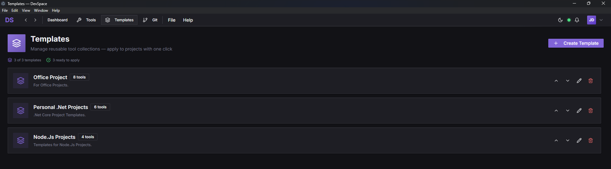
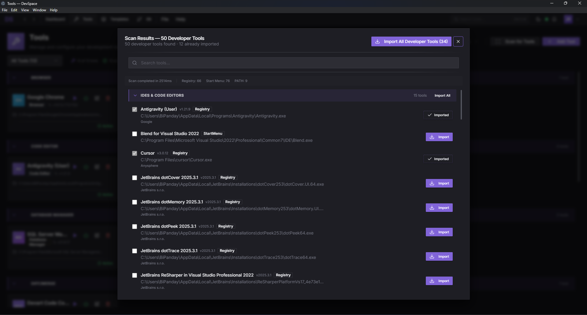
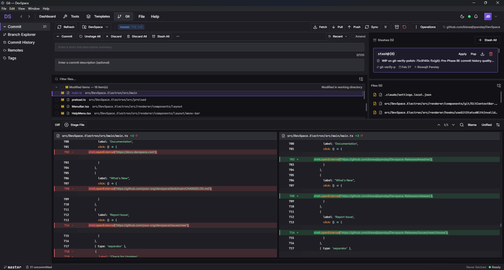
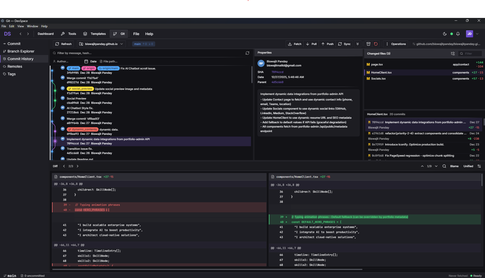
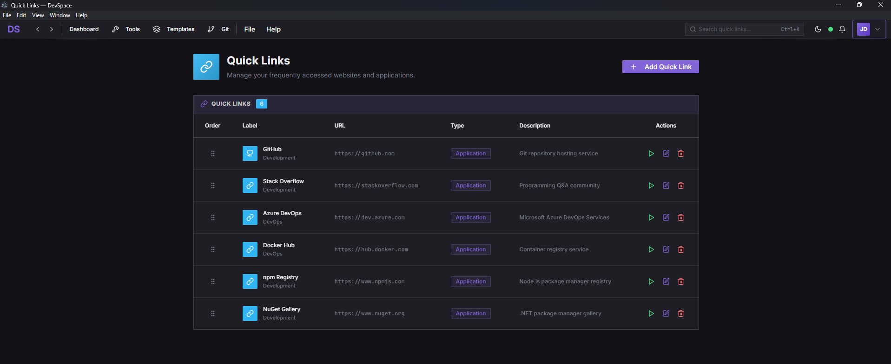
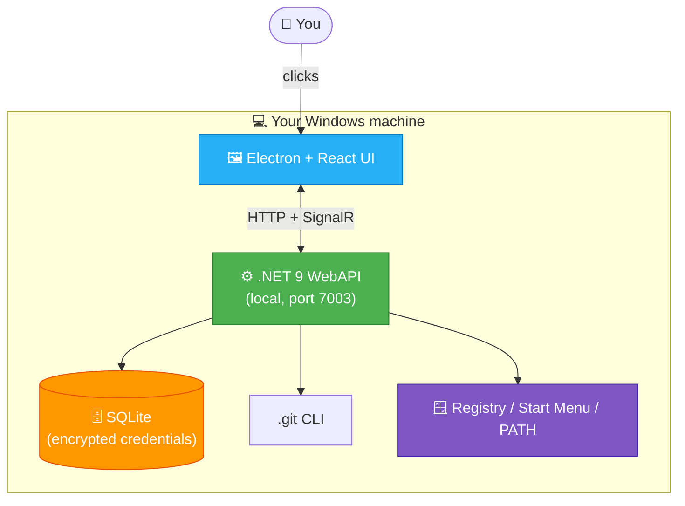

<!--
This file is the README for the PUBLIC release repo: github.com/biswajitpanday/Devspace-Releases
Copy its contents into that repo's README.md (overwriting whatever is there).

Screenshots needed in the public repo at /assets/:
- hero.png             Dashboard
- tool-discovery.png   Auto-discovered tools
- git-view.png         Git commit graph
- project-details.png  Project details view (tools, credentials, quick actions)
- wizard.png           Project setup wizard
- demo.gif             Optional 10-15s demo
-->

# DevSpace

### Centralize every developer project. Tools, credentials, git, terminals — one dashboard.

[**🌐 Website**](https://biswajitpanday.github.io/devspace/) · [**⬇️ Download**](https://github.com/biswajitpanday/Devspace-Releases/releases/latest) · [**🔒 Privacy**](PRIVACY.md) · [**🐛 Report a bug**](https://github.com/biswajitpanday/Devspace-Releases/issues)

---

## 🤔 The problem

Every developer morning looks the same:

| 🔄 Switch project | Mentally re-establish context |
| :--- | :--- |
| 🛠️ Open the *right* IDE | For *this* stack |
| 📋 Find the credentials | Notion? Sticky note? `.env`? |
| 💻 Spawn 3 terminals | Build, git, tail |
| 🌐 Open the right tabs | Docs, dashboard, ticket tracker |
| 🗄️ Launch the DB client | Connect with the right credentials |

**~30 minutes lost. Every. Single. Day.**

## ✅ The solution

DevSpace gives you **one card per project** on a dashboard. Click it and your IDE, terminals, browser tabs, and DB client launch — exactly the way you set them up.

<table>
<tr>
<td width="50%"></td>
<td width="50%"></td>
</tr>
<tr>
<td><b>Auto-discovers 100+ tools in &lt;3 seconds</b> Dynamic Windows enumeration finds every IDE, CLI, browser, and DB client on your machine.</td>
<td><b>Full git workflow built in</b> Commit graph, blame, conflict resolver, branch compare, stash. No more terminal context-switching.</td>
</tr>
<tr>
<td width="50%"></td>
<td width="50%"></td>
</tr>
<tr>
<td><b>Multiple encrypted credentials per project</b> DPAPI-encrypted vault, drag-to-reorder, custom labels, one-click copy. Tools, credentials, quick actions — all in one card.</td>
<td><b>Tool Templates — reusable collections</b> Save your most-used tool sets (".NET API", "React Frontend") and apply them to any project in one click. Bulk-import into existing projects.</td>
</tr>
</table>

---

## ⬇️ Download

### [Download DevSpace v2.2.0-preview for Windows](https://github.com/biswajitpanday/Devspace-Releases/releases/latest)

| Format | File | Size | Best for |
|---|---|---|---|
| **NSIS Installer** | `DevSpace.Setup.*.exe` | ~80 MB | Most users — start menu, auto-update |
| **Portable Zip** | `DevSpace-*-portable.zip` | ~75 MB | USB-portable, no install |

**System requirements:** Windows 10 (64-bit) or Windows 11 · 4 GB RAM · 500 MB free disk

---

## ✨ Features

### 🔍 Auto-discover your dev tools

- Dynamic Windows enumeration in parallel: Registry ARP (HKLM, HKLM\WOW6432Node, HKCU) + Start Menu shortcuts + PATH scanning
- Finds **100+ apps in under 3 seconds** on a typical dev machine
- Zero hardcoded patterns — new tools appear automatically as you install them
- Smart classification across 16 categories: IDEs, runtimes, SCM, containers, databases, terminals, browsers, build tools, cloud CLIs, and more

### 🔄 Manual rescan with live progress

- One-click **Scan Tools** rescans your machine after you install something new
- Live SignalR progress: each source (Registry / Start Menu / PATH) reports in real time
- Diff against last scan — see what's new, what changed
- Skip or undo individual results before saving

### 📑 Tool Templates — reusable tool collections

- Save your most-used tool sets (e.g. **".NET API"**, **"React Frontend"**, **"Data Pipeline"**)
- Apply to a project in one click — all configured tools added at once
- Edit and reuse across projects · top-level navigation at `/templates`
- Bulk-import tools from a template into existing projects too — no need to re-add one by one

### 🔐 Multiple encrypted credentials per project

- Per-project credentials encrypted with **Microsoft DataProtection (DPAPI)**, tied to your Windows user account — never plain text on disk
- **Multiple credentials per project**: dev DB password, staging DB, API tokens, SSH keys — all in one card
- Drag-and-drop to reorder · one-click copy with success feedback
- Custom labels per credential (Username, DB Password, API Token, anything you want)

### 🛠️ Add or edit projects in 3 steps

- 3-step wizard: **Basic Info → Directories → Credentials**
- Auto-detects git on directory selection — no manual repo URL needed
- Apply a Tool Template during creation to bulk-add tools
- Same wizard, **Edit mode** — every field stays editable

### 📊 Full git workflow, built in

- Visual commit graph: zoom 20-300%, filter by branch / author / date
- 4-panel layout: graph + commit details + staging area + diff viewer
- 6-tab sidebar: **Commit · Branch Explorer · Commit History · Remotes · Tags · Stashes**
- Stash management, cherry-pick, rebase, merge, conflict resolver, branch comparison
- 27-language syntax highlighting · word-level diff · whitespace toggle · Ctrl+F search

### ✏️ Commit panel with hunk-level staging

- Stage individual hunks or whole files using real `git add` / `git restore --staged` (not faked)
- Live diff preview as you stage
- Inline commit message + commit button — no separate dialog
- 13 input dialogs · 4 context menus · 10+ keyboard shortcuts · Ctrl+K command palette

### 📜 Commit history with smart filters

- Filter by branch, author, or date
- Click any commit for full details + diff
- Per-file history view · blame view · branch comparison
- Manual refresh button — no disk-thrashing auto-poll

### 🔗 Personalized quick links

- Pin your most-used URLs, terminal commands, or apps to the dashboard
- Three types: 🌐 **Web link** · 💻 **Terminal command** · ▶️ **Application launch**
- Always one click away — no project context needed
- Stored locally, synced via cloud sync (when that ships)

### 🏠 One dashboard, every project

- Pin frequently-used projects · search by tag, organization, or path
- Bulk-import git repos by scanning directory trees (auto-finds every `.git` repo, deduplicates, imports in one click)
- Per-project: tools, credentials, quick commands, git status
- Up to 6 quick-action buttons per project, drag-and-drop reorderable

---

## 🏗️ How it works

A two-process desktop app: an **Electron renderer** for the UI, a **local .NET 9 WebAPI** for everything else (running on `localhost:7003`).

**Local-first.** Your data never leaves your machine. No cloud account required, no telemetry in this release.

**Stack:** Electron · React 18 · TypeScript · Tailwind CSS · Redux Toolkit · .NET 9 · Entity Framework Core · SignalR · SQLite · Clean Architecture · CQRS · DDD

---

## 🔒 Privacy & security

DevSpace is built privacy-first.

- ✅ **Local-first**: project data, credentials, and git history never leave your machine
- ✅ **No telemetry**: this release collects nothing — no app launch pings, no analytics. Future versions will be opt-in only.
- ✅ **Encryption at rest**: credentials encrypted with Windows DPAPI, scoped to your user account
- ✅ **Shell command whitelist**: 21 vetted commands with argument sanitization — no arbitrary code execution
- ✅ **No analytics, no ads, no third-party SDKs** in the binary

📄 **[Read the full privacy policy](PRIVACY.md)**

---

## 🗺️ Roadmap

| Status | Phase | What |
|---|---|---|
| ✅ Shipped | v2.2.0-preview (Apr 2026) | Public preview · tool templates · typography overhaul · market readiness |
| 🚧 In progress | Cloud sync (Phase 1) | Supabase-backed, opt-in: settings, theme, recent projects |
| 📋 Planned | macOS support | Once Windows is rock-solid |

---

## 🐛 Found a bug?

Open an issue: [github.com/biswajitpanday/Devspace-Releases/issues](https://github.com/biswajitpanday/Devspace-Releases/issues)

Bug reports with the following are gold:
- Windows version (run `winver`)
- DevSpace version (Help → About DevSpace)
- Steps to reproduce
- Screenshot if it's visual

---

## 💖 Support the project

DevSpace is free during the public preview. If it saves you time:

- ⭐ **Star this repo** — costs nothing, helps a lot
- 💼 **Hire me**: [linkedin.com/in/biswajitpanday](https://www.linkedin.com/in/biswajitpanday/) — open to opportunities in Germany
- 📰 **Share with developers** who'd find it useful
- 🐛 **Report bugs** — every report makes the next release better

---

## 📄 License

DevSpace is **free during the public preview** for personal and commercial use on Windows machines you own or control.

This repository contains **release binaries only**. Source code is **proprietary** and not distributed.

See [LICENSE.md](LICENSE.md) for the full End User License Agreement (no redistribution, no reverse engineering, build expires 2027-04-26, etc.).

---

## 👤 Authors

**Biswajit Panday** — Senior .NET Architect & AI Solutions Engineer (Lead)

**Abdullah Saleh Robin** — Co-author

*Built with ❤️ on nights and weekends — concept to public preview, 18 months.*

